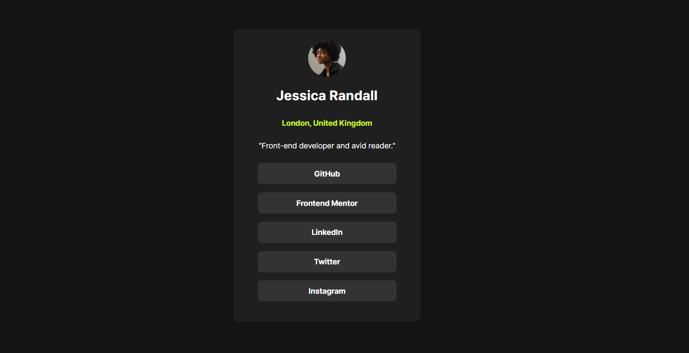
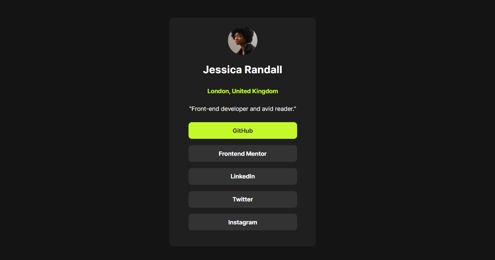

# Frontend Mentor - Social links profile

This is a solution to the [Social links profile challenge on Frontend Mentor](https://www.frontendmentor.io/challenges/social-links-profile-UG32l9m6dQ)

## Table of contents

- [Overview](#overview)
  - [The challenge](#the-challenge)
  - [Screenshot](#screenshot)
  - [Links](#links)
- [My process](#my-process)
  - [Built with](#built-with)
  - [What I learned](#what-i-learned)
 
 ## Overview 💻

### The challenge

Users should be able to:

- See hover and focus states for all interactive elements on the page

### Screenshot

- With active states

### Links

- Live Site URL:https://larissafiali.github.io/social-links-profile/

## My process 📚
### Built with 
- Semantic HTML5 markup
- CSS custom properties
- Flexbox

### What I learned
In this project I put flex-box concepts into practice. I was also able to put into practice my knowledge on how to create actions (such as hover) on certain elements

## Contact 
- LinkedIn: www.linkedin.com/in/larissa-fiali-3a1a25286
